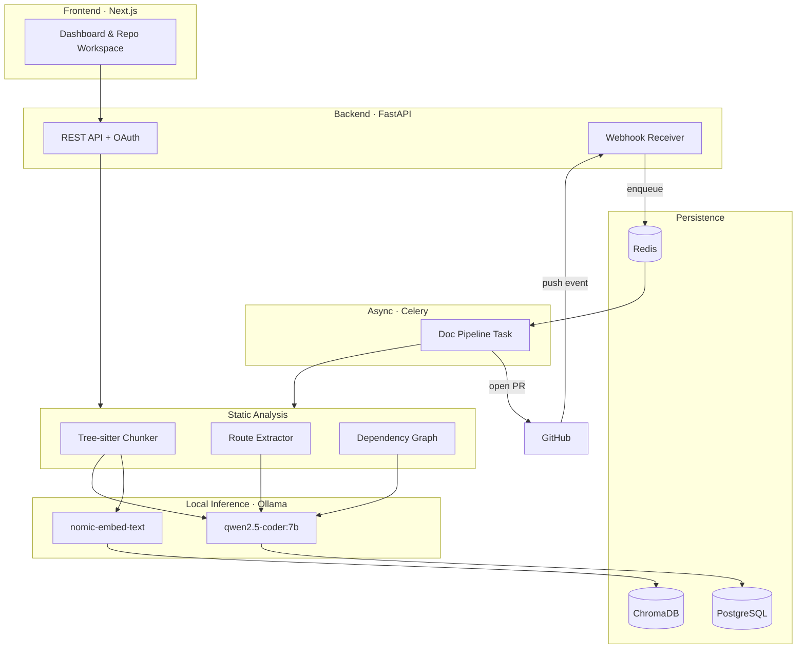

<div align="center">

# SAGE

### Self-updating Autonomous Generator for Engineering-docs

**An autonomous documentation engineer for GitHub repositories.**
Connect a repo — SAGE reads the code, understands what it does, writes the documentation, and opens a pull request. On every push, it does it again.

[](https://www.python.org/)
[](https://fastapi.tiangolo.com/)
[](https://nextjs.org/)
[](https://www.postgresql.org/)
[](https://ollama.com/)
[](LICENSE)

**100% local inference · Zero API cost · Runs on a single consumer GPU**

</div>

---

## The problem

Documentation is the first thing to rot. It is written once, at the moment of least understanding, and then abandoned. Every commit after that widens the gap between what the code does and what the docs claim it does. Nobody wants to be the person who fixes it, because fixing it is a chore that never ends.

SAGE ends it. It treats documentation as a build artifact — something derived from the source of truth (the code), regenerated automatically when the source changes, and delivered through the same review process as any other change: a pull request.

---

## What SAGE does

| Capability | How it works |
|---|---|
| **Reads your code** | Clones the repo and parses every source file into function- and class-level chunks using Tree-sitter ASTs — not naive line splitting |
| **Understands it semantically** | Embeds each chunk locally with `nomic-embed-text` and indexes it in ChromaDB, enabling semantic retrieval over the codebase |
| **Writes the README** | Generates a full project README grounded in representative code chunks, not hallucinated from the repo name |
| **Writes per-module docs** | One documentation file per source file — purpose, key functions/classes, dependencies |
| **Extracts API references** | Detects HTTP routes (FastAPI, Flask, Express) deterministically via static analysis, then uses the LLM only to describe them — routes are never guessed |
| **Draws architecture diagrams** | Builds a real module dependency graph from actual import statements and renders it as a Mermaid flowchart |
| **Opens a pull request** | Writes every artifact to a new branch and opens a PR for human review. It never merges anything itself |
| **Stays up to date** | A GitHub webhook fires on every push, enqueuing a Celery job that re-runs the pipeline incrementally |

**The design principle throughout:** anything that can be determined *deterministically* — routes, imports, the dependency graph, file structure — is determined by static analysis. The LLM is used only for what genuinely requires language understanding: prose. This is why SAGE's API docs list real endpoints and its diagrams show real dependencies, rather than plausible-sounding fiction.

---

## Architecture



### The pipeline, end to end

```
git clone  →  Tree-sitter parse  →  chunk (fn/class level)  →  embed (local GPU)
      →  ChromaDB index  →  semantic retrieval  →  LLM generation  →  artifacts
      →  new branch  →  commit  →  pull request
```

Every stage is idempotent. A doc run compares the repo's HEAD SHA against the last indexed SHA and skips entirely if nothing changed — pushes that don't touch code don't burn GPU time.

---

## Stack

| Layer | Technology | Why |
|---|---|---|
| **API** | FastAPI, Uvicorn, Pydantic v2 | Async-native, auto-generated OpenAPI docs |
| **Async jobs** | Celery + Redis | Long-running LLM pipelines can't block HTTP requests |
| **Database** | PostgreSQL 16, SQLAlchemy 2.0 (async), Alembic | Versioned schema, async ORM |
| **Vector store** | ChromaDB | Persistent local embeddings, one collection per repo |
| **Code parsing** | Tree-sitter (`tree-sitter-language-pack`) | Real ASTs — Python, JavaScript, TypeScript, TSX |
| **LLM** | Ollama · `qwen2.5-coder:7b` | Code-specialized, fits in 8 GB VRAM, zero cost |
| **Embeddings** | Ollama · `nomic-embed-text` | Local, fast, no API key |
| **Git & GitHub** | GitPython, PyGithub | Clone/branch/commit locally, PRs via the API |
| **Frontend** | Next.js 16 (App Router), TypeScript, Tailwind | Server components, typed API client |
| **Diagrams** | Mermaid.js | Renders in the app *and* natively on GitHub |
| **Logging** | structlog | Structured, machine-parseable logs |
| **Infra** | Docker Compose | Postgres + Redis + pgAdmin, one command |

---

## Quick start

### Prerequisites

- Python 3.11+
- Node.js 20+
- Docker Desktop
- [Ollama](https://ollama.com/download)
- An NVIDIA GPU with ~8 GB VRAM (CPU inference works, but slowly)

### 1. Pull the models

```bash
ollama pull qwen2.5-coder:7b
ollama pull nomic-embed-text
```

### 2. Start the infrastructure

```bash
git clone https://github.com/lakshit2234/SAGE.git
cd SAGE
cp .env.example .env
docker compose --env-file .env -f infra/compose/docker-compose.yml up -d
```

This brings up PostgreSQL (`:5432`), Redis (`:6379`), and pgAdmin (`:5050`).

### 3. Configure GitHub OAuth

Create an OAuth app at **[github.com/settings/developers](https://github.com/settings/developers)**:

| Field | Value |
|---|---|
| Homepage URL | `http://localhost:8000` |
| Authorization callback URL | `http://localhost:8000/auth/github/callback` |

Add the credentials to `.env`:

```env
GITHUB_OAUTH_CLIENT_ID=your_client_id
GITHUB_OAUTH_CLIENT_SECRET=your_client_secret
GITHUB_WEBHOOK_SECRET=any_random_string
SESSION_SECRET=any_random_string
```

### 4. Run the backend

```bash
python -m venv .venv
source .venv/bin/activate          # Windows: .\.venv\Scripts\Activate.ps1
pip install -e "apps/backend[dev]"

cd apps/backend && alembic upgrade head && cd ../..
python -m sage
```

API: **http://localhost:8000** · Interactive docs: **http://localhost:8000/docs**

### 5. Run the worker

```bash
cd apps/backend
celery -A sage.workers.celery_app worker --loglevel=info --pool=solo
```

> `--pool=solo` is required on Windows.

### 6. Run the frontend

```bash
cd apps/frontend
npm install
npm run dev
```

App: **http://localhost:3000**

### 7. Verify

```bash
curl http://localhost:8000/health
```

```json
{
  "status": "ok",
  "components": [
    { "name": "postgres", "ok": true, "detail": "PostgreSQL 16.14" },
    { "name": "redis",    "ok": true, "detail": "PONG" },
    { "name": "ollama",   "ok": true, "detail": "models present" }
  ]
}
```

---

## API reference

### Auth

| Method | Endpoint | Description |
|---|---|---|
| `GET` | `/auth/github/login` | Begin OAuth flow |
| `GET` | `/auth/github/callback` | OAuth callback |
| `GET` | `/auth/me` | Current user |
| `GET` | `/auth/github/logout` | Clear session |

### Repositories

| Method | Endpoint | Description |
|---|---|---|
| `GET` | `/repos/github` | List connectable GitHub repos |
| `POST` | `/repos/connect` | Clone, chunk, and embed a repo |
| `GET` | `/repos` | List connected repos |
| `GET` | `/repos/{owner}/{name}/search?q=` | Semantic code search |

### Documentation

| Method | Endpoint | Description |
|---|---|---|
| `POST` | `/docs/{owner}/{name}/generate/readme` | Generate a README |
| `POST` | `/docs/{owner}/{name}/generate/modules` | Generate per-file docs (batch) |
| `POST` | `/docs/{owner}/{name}/generate/api-docs` | Extract routes + generate API reference |
| `POST` | `/docs/{owner}/{name}/generate/architecture` | Build dependency graph + Mermaid diagram |
| `GET` | `/docs/{owner}/{name}/runs` | Doc run history |
| `GET` | `/docs/{owner}/{name}/artifacts` | List generated artifacts |
| `GET` | `/docs/{owner}/{name}/artifacts/{id}` | Fetch a single artifact |
| `POST` | `/docs/{owner}/{name}/open-pr` | Open a PR with a run's artifacts |

### Webhooks

| Method | Endpoint | Description |
|---|---|---|
| `POST` | `/webhooks/github` | HMAC-verified push receiver → enqueues pipeline |

Full interactive reference at `/docs` when the server is running.

---

## Data model

```
repositories        owner, name, default_branch, last_indexed_commit_sha, is_active
    │
    ├── doc_runs            triggered_by (manual|webhook), commit_sha, status, stats
    │       │
    │       └── doc_artifacts   artifact_type, file_path, content, content_hash
    │
    └── commit_events       commit_sha, author, message, raw payload
```

`content_hash` enables change detection — artifacts that would be byte-identical to what's already in the repo don't produce a PR.

---

## Design decisions worth defending

**Static analysis over LLM guessing.** Route extraction, the import graph, and file structure are computed from the actual source, not inferred. An LLM asked to "list the API endpoints" will invent plausible ones. A regex over `@router.post(...)` will not.

**Sequential inference, not parallel.** A single consumer GPU serves one generation request well and several requests badly. The embedding and generation paths are deliberately serialized (`concurrency=1`, `worker_prefetch_multiplier=1`) with retry-and-skip semantics, so one pathological chunk cannot fail an entire run.

**PRs, not pushes.** SAGE never writes to a default branch. Every output lands in a pull request, because generated documentation is a *proposal*, and a human should approve it.

**SHA-based idempotency.** The pipeline compares HEAD against the last indexed commit and exits early if they match. Webhooks fire often; work should not.

**Local-first.** No OpenAI key, no Anthropic key, no per-token cost, no data leaving the machine. A student can run the entire system on a laptop, and so can a company with a private codebase it cannot send to a third party.

---

## Repository layout

```
SAGE/
├── apps/
│   ├── backend/
│   │   ├── sage/
│   │   │   ├── api/          Route handlers (auth, repos, docs, webhooks, health)
│   │   │   ├── core/         Config (Pydantic Settings) and structured logging
│   │   │   ├── db/           SQLAlchemy models and async session factory
│   │   │   ├── services/     Chunker, embeddings, vector store, LLM, generators, PR bot
│   │   │   ├── workers/      Celery app and tasks
│   │   │   └── schemas/      Pydantic request/response models
│   │   └── migrations/       Alembic
│   └── frontend/             Next.js dashboard
├── infra/compose/            Docker Compose (Postgres, Redis, pgAdmin)
├── scripts/                  Dev helpers
└── docs/                     Design notes
```

---

## Roadmap

- [ ] Docstring injection — write missing docstrings back into source files as a PR
- [ ] Language coverage beyond Python/JS/TS (Go, Rust, Java via Tree-sitter grammars)
- [ ] Incremental re-embedding — only re-process files touched by the diff
- [ ] Sequence and ER diagram generation
- [ ] Confidence scoring — flag generated sections the model was least certain about
- [ ] Hosted deployment (Fly.io + Neon + a GPU inference endpoint)

---

## License

MIT — see [LICENSE](LICENSE).

---

<div align="center">

**Built by [Lakshit](https://github.com/lakshit2234)** · Final-year B.Tech CSE capstone

*SAGE documented its own codebase. The architecture diagram above came from its own dependency graph.*

</div>
