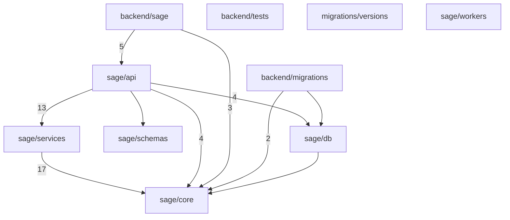

# Architecture Diagram

```mermaid
flowchart TD
    backend_migrations["backend/migrations"]
    backend_sage["backend/sage"]
    backend_tests["backend/tests"]
    migrations_versions["migrations/versions"]
    sage_api["sage/api"]
    sage_core["sage/core"]
    sage_db["sage/db"]
    sage_schemas["sage/schemas"]
    sage_services["sage/services"]
    sage_workers["sage/workers"]
    sage_services -->|17| sage_core
    sage_api -->|13| sage_services
    backend_sage -->|5| sage_api
    sage_api -->|4| sage_core
    sage_api -->|4| sage_db
    backend_sage -->|3| sage_core
    backend_migrations -->|2| sage_core
    backend_migrations --> sage_db
    sage_api --> sage_schemas
    sage_db --> sage_core
```
